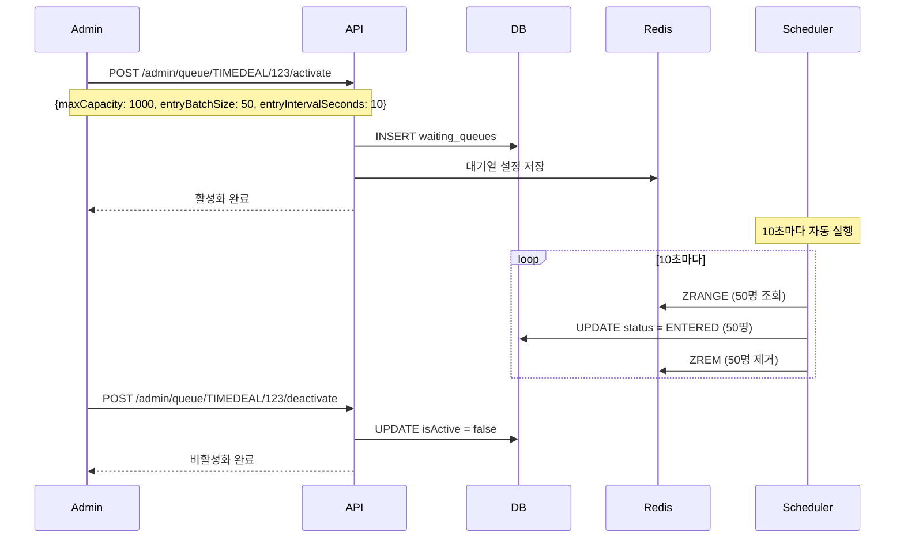

# Admin Queue API

> 관리자 전용 대기열 관리 API (활성화, 비활성화, 수동 처리)

---

## 📋 개요

| 항목 | 내용 |
|------|------|
| **Base URL** | `/api/admin/shopping/queue` |
| **인증** | Bearer Token 필요 |
| **권한** | ADMIN 전용 (모든 엔드포인트) |
| **버전** | v1 |

---

## 📑 API 목록

| Method | Endpoint | 설명 | 인증 | 권한 |
|--------|----------|------|------|------|
| POST | `/{eventType}/{eventId}/activate` | 대기열 활성화 | ✅ | ADMIN |
| POST | `/{eventType}/{eventId}/deactivate` | 대기열 비활성화 | ✅ | ADMIN |
| POST | `/{eventType}/{eventId}/process` | 대기열 수동 처리 | ✅ | ADMIN |

---

## 🔹 대기열 활성화

특정 이벤트(타임딜 등)에 대한 대기열을 활성화합니다. (관리자 전용)

### Request

```http
POST /api/admin/shopping/queue/{eventType}/{eventId}/activate
Content-Type: application/json
Authorization: Bearer {token}

{
  "maxCapacity": 1000,
  "entryBatchSize": 50,
  "entryIntervalSeconds": 10
}
```

### Path Parameters

| 파라미터 | 타입 | 필수 | 설명 | 예시 |
|----------|------|------|------|------|
| `eventType` | string | ✅ | 이벤트 유형 | `TIMEDEAL`, `FLASH_SALE` |
| `eventId` | long | ✅ | 이벤트 ID | 타임딜 ID |

### Request Body

| 필드 | 타입 | 필수 | 설명 | 제약조건 |
|------|------|------|------|----------|
| `maxCapacity` | integer | ✅ | 동시 입장 가능 인원 | 최소 1 |
| `entryBatchSize` | integer | ✅ | 한 번에 입장시킬 인원 | 최소 1 |
| `entryIntervalSeconds` | integer | ✅ | 입장 간격 (초) | 최소 1 |

### 파라미터 설명

#### maxCapacity
동시에 이벤트 페이지에 입장할 수 있는 최대 인원입니다.
- 예: 1000명 → 1000명까지 동시 접속 가능
- 1000명 초과 시 대기열에서 대기

#### entryBatchSize
한 번의 입장 처리에서 대기열에서 입장시킬 인원 수입니다.
- 예: 50명 → 10초마다 50명씩 입장
- 입장 인원이 많을수록 대기 시간 단축, 서버 부하 증가

#### entryIntervalSeconds
입장 처리 주기(초)입니다.
- 예: 10초 → 10초마다 입장 처리 실행
- 짧을수록 빠른 입장, 서버 부하 증가

### Response (200 OK)

```json
{
  "success": true,
  "data": null,
  "timestamp": "2026-01-19T14:00:00Z"
}
```

### Error Response

#### 이미 활성화된 대기열

```json
{
  "success": false,
  "code": "S013",
  "message": "대기열이 이미 활성화되어 있습니다.",
  "timestamp": "2026-01-19T14:00:00Z"
}
```

#### 유효성 검증 실패

```json
{
  "success": false,
  "code": "S002",
  "message": "유효성 검증 실패: maxCapacity는 최소 1 이상이어야 합니다",
  "timestamp": "2026-01-19T14:00:00Z"
}
```

---

## 🔹 대기열 비활성화

특정 이벤트의 대기열을 비활성화합니다. (관리자 전용)

비활성화 시:
- 새로운 사용자는 대기열에 진입할 수 없음
- 이미 대기 중인 사용자는 계속 입장 가능
- 입장 처리는 계속 진행됨

### Request

```http
POST /api/admin/shopping/queue/{eventType}/{eventId}/deactivate
Authorization: Bearer {token}
```

### Path Parameters

| 파라미터 | 타입 | 필수 | 설명 |
|----------|------|------|------|
| `eventType` | string | ✅ | 이벤트 유형 |
| `eventId` | long | ✅ | 이벤트 ID |

### Response (200 OK)

```json
{
  "success": true,
  "data": null,
  "timestamp": "2026-01-19T15:00:00Z"
}
```

### Error Response

```json
{
  "success": false,
  "code": "S010",
  "message": "대기열을 찾을 수 없습니다.",
  "timestamp": "2026-01-19T15:00:00Z"
}
```

---

## 🔹 대기열 수동 처리

대기열 입장을 수동으로 즉시 처리합니다. (관리자 전용)

스케줄러를 기다리지 않고 즉시 `entryBatchSize` 만큼 입장시킵니다.

### Request

```http
POST /api/admin/shopping/queue/{eventType}/{eventId}/process
Authorization: Bearer {token}
```

### Path Parameters

| 파라미터 | 타입 | 필수 | 설명 |
|----------|------|------|------|
| `eventType` | string | ✅ | 이벤트 유형 |
| `eventId` | long | ✅ | 이벤트 ID |

### Response (200 OK)

```json
{
  "success": true,
  "data": null,
  "timestamp": "2026-01-19T14:30:00Z"
}
```

### 사용 사례

- **긴급 상황**: 대기열이 과도하게 밀렸을 때 수동 처리
- **테스트**: 개발/QA 환경에서 대기열 동작 확인
- **이벤트 종료**: 이벤트 종료 전 대기 인원 모두 입장 처리

---

## ⚠️ 에러 코드

| Code | HTTP Status | 설명 |
|------|-------------|------|
| `S002` | 400 | 유효성 검증 실패 |
| `S010` | 404 | 대기열을 찾을 수 없습니다 |
| `S013` | 409 | 대기열이 이미 활성화되어 있습니다 |
| `C001` | 401 | 인증 필요 |
| `C002` | 403 | 권한 없음 (ADMIN 전용) |

---

## 🔄 워크플로우

### 타임딜 대기열 활성화 시나리오



---

## 📊 대기열 설정 가이드

### 추천 설정값

#### 소규모 이벤트 (예: 한정 수량 100개)
```json
{
  "maxCapacity": 500,
  "entryBatchSize": 20,
  "entryIntervalSeconds": 5
}
```
- **처리 속도**: 초당 4명 입장
- **예상 대기 시간**: 500명 대기 시 약 2분

#### 중규모 이벤트 (예: 타임딜 1000개)
```json
{
  "maxCapacity": 2000,
  "entryBatchSize": 50,
  "entryIntervalSeconds": 10
}
```
- **처리 속도**: 초당 5명 입장
- **예상 대기 시간**: 1000명 대기 시 약 3분

#### 대규모 이벤트 (예: 플래시 세일)
```json
{
  "maxCapacity": 5000,
  "entryBatchSize": 100,
  "entryIntervalSeconds": 5
}
```
- **처리 속도**: 초당 20명 입장
- **예상 대기 시간**: 5000명 대기 시 약 4분

### 설정 시 고려사항

1. **서버 성능**
   - `entryBatchSize`가 클수록 서버 부하 증가
   - DB 커넥션 풀 크기 고려

2. **사용자 경험**
   - `entryIntervalSeconds`가 짧을수록 빠른 입장
   - 너무 짧으면 SSE 업데이트 부담

3. **재고 소진 속도**
   - 재고가 빠르게 소진되는 경우 `entryBatchSize` 작게 설정
   - 충분한 재고가 있으면 크게 설정

---

## 📌 비즈니스 규칙

### 대기열 활성화
- 동일 이벤트에 대한 대기열은 한 번만 활성화 가능
- 이미 활성화된 경우 409 에러 반환
- 활성화 시 `activatedAt` 타임스탬프 기록

### 대기열 비활성화
- 비활성화 후에도 대기 중인 사용자는 계속 입장 가능
- 새로운 진입은 차단됨 (`S009` 에러)
- 비활성화 시 `deactivatedAt` 타임스탬프 기록

### 수동 처리
- 스케줄러와 독립적으로 동작
- `entryBatchSize` 설정값을 따름
- 현재 대기 인원이 `entryBatchSize`보다 적으면 전체 입장

### 자동 스케줄링
- Spring `@Scheduled` 기반 자동 실행
- 모든 활성화된 대기열을 순회하며 처리
- `entryIntervalSeconds` 주기로 실행

---

## 🧪 테스트 시나리오

### 1. 대기열 활성화 테스트

```bash
# 1. 대기열 활성화
curl -X POST http://localhost:8080/api/admin/shopping/queue/TIMEDEAL/123/activate \
  -H "Authorization: Bearer {admin_token}" \
  -H "Content-Type: application/json" \
  -d '{
    "maxCapacity": 100,
    "entryBatchSize": 10,
    "entryIntervalSeconds": 5
  }'

# 2. 사용자 진입 (다수)
for i in {1..50}; do
  curl -X POST http://localhost:8080/api/shopping/queue/TIMEDEAL/123/enter \
    -H "Authorization: Bearer {user_token}" \
    -H "X-User-Id: $i"
done

# 3. 수동 처리 (10명 입장)
curl -X POST http://localhost:8080/api/admin/shopping/queue/TIMEDEAL/123/process \
  -H "Authorization: Bearer {admin_token}"

# 4. 대기열 비활성화
curl -X POST http://localhost:8080/api/admin/shopping/queue/TIMEDEAL/123/deactivate \
  -H "Authorization: Bearer {admin_token}"
```

---

## 🔗 관련 문서

- [Queue API](./queue-api.md) (사용자용 대기열 API)
- [Admin TimeDeal API](./admin-timedeal-api.md)
- [ADR-002: Queue System Design](../adr/ADR-002-queue-system-design.md)

---

**최종 업데이트**: 2026-01-19
