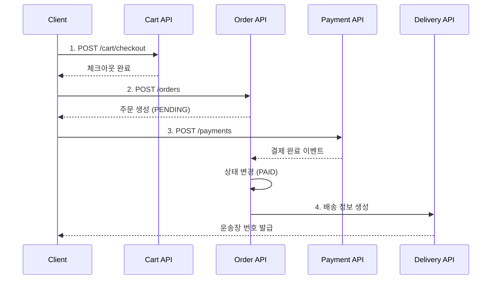

# Order API

> 주문 관리 API (생성, 조회, 취소)

---

## 📋 개요

| 항목 | 내용 |
|------|------|
| **Base URL** | `/api/shopping/orders` |
| **인증** | Bearer Token 필요 (필수) |
| **버전** | v1 |

---

## 📑 API 목록

| Method | Endpoint | 설명 |
|--------|----------|------|
| POST | `/` | 주문 생성 |
| GET | `/` | 주문 목록 조회 |
| GET | `/{orderNumber}` | 주문 상세 조회 |
| POST | `/{orderNumber}/cancel` | 주문 취소 |

---

## 🔹 주문 생성

주문을 생성합니다. 장바구니가 체크아웃된 상태여야 합니다.

### Request

```http
POST /api/shopping/orders
Content-Type: application/json
Authorization: Bearer {token}

{
  "shippingAddress": {
    "recipientName": "홍길동",
    "phone": "010-1234-5678",
    "zipCode": "12345",
    "address": "서울시 강남구 테헤란로 123",
    "addressDetail": "456호"
  },
  "paymentMethod": "CARD",
  "notes": "문 앞에 놓아주세요"
}
```

### Request Body

| 필드 | 타입 | 필수 | 설명 | 제약조건 |
|------|------|------|------|----------|
| `shippingAddress` | object | ✅ | 배송지 정보 | - |
| `shippingAddress.recipientName` | string | ✅ | 수령인 이름 | 1~50자 |
| `shippingAddress.phone` | string | ✅ | 연락처 | 전화번호 형식 |
| `shippingAddress.zipCode` | string | ✅ | 우편번호 | 5자리 |
| `shippingAddress.address` | string | ✅ | 주소 | 1~200자 |
| `shippingAddress.addressDetail` | string | ❌ | 상세 주소 | 최대 100자 |
| `paymentMethod` | string | ✅ | 결제 방법 | CARD, BANK, VIRTUAL_ACCOUNT |
| `notes` | string | ❌ | 배송 메모 | 최대 500자 |

### Response (200 OK)

```json
{
  "success": true,
  "data": {
    "orderNumber": "ORD-20260118-001",
    "userId": "user123",
    "items": [
      {
        "productId": 10,
        "productName": "Spring Boot 완벽 가이드",
        "price": 35000,
        "quantity": 2,
        "subtotal": 70000
      }
    ],
    "totalAmount": 70000,
    "shippingAddress": {
      "recipientName": "홍길동",
      "phone": "010-1234-5678",
      "zipCode": "12345",
      "address": "서울시 강남구 테헤란로 123",
      "addressDetail": "456호"
    },
    "paymentMethod": "CARD",
    "status": "PENDING",
    "notes": "문 앞에 놓아주세요",
    "createdAt": "2026-01-18T10:30:00Z"
  },
  "timestamp": "2026-01-18T10:30:00Z"
}
```

### Order Status

| Status | 설명 |
|--------|------|
| `PENDING` | 주문 대기 (결제 전) |
| `PAID` | 결제 완료 |
| `PREPARING` | 상품 준비 중 |
| `SHIPPED` | 배송 중 |
| `DELIVERED` | 배송 완료 |
| `CANCELLED` | 주문 취소 |

---

## 🔹 주문 목록 조회

사용자의 주문 목록을 조회합니다. (페이징 지원)

### Request

```http
GET /api/shopping/orders?page=0&size=10
Authorization: Bearer {token}
```

### Query Parameters

| 파라미터 | 타입 | 필수 | 설명 | 기본값 |
|----------|------|------|------|--------|
| `page` | int | ❌ | 페이지 번호 (0부터 시작) | 0 |
| `size` | int | ❌ | 페이지 크기 | 10 |
| `sort` | string | ❌ | 정렬 기준 | createdAt,desc |

### Response (200 OK)

```json
{
  "success": true,
  "data": {
    "content": [
      {
        "orderNumber": "ORD-20260118-001",
        "totalAmount": 70000,
        "status": "PAID",
        "createdAt": "2026-01-18T10:30:00Z"
      },
      {
        "orderNumber": "ORD-20260117-005",
        "totalAmount": 45000,
        "status": "DELIVERED",
        "createdAt": "2026-01-17T15:20:00Z"
      }
    ],
    "page": {
      "number": 0,
      "size": 10,
      "totalElements": 25,
      "totalPages": 3
    }
  },
  "timestamp": "2026-01-18T10:30:00Z"
}
```

---

## 🔹 주문 상세 조회

주문 번호로 주문을 조회합니다.

### Request

```http
GET /api/shopping/orders/{orderNumber}
Authorization: Bearer {token}
```

### Path Parameters

| 파라미터 | 타입 | 필수 | 설명 |
|----------|------|------|------|
| `orderNumber` | string | ✅ | 주문 번호 (예: ORD-20260118-001) |

### Response (200 OK)

```json
{
  "success": true,
  "data": {
    "orderNumber": "ORD-20260118-001",
    "userId": "user123",
    "items": [
      {
        "productId": 10,
        "productName": "Spring Boot 완벽 가이드",
        "price": 35000,
        "quantity": 2,
        "subtotal": 70000
      }
    ],
    "totalAmount": 70000,
    "shippingAddress": {
      "recipientName": "홍길동",
      "phone": "010-1234-5678",
      "zipCode": "12345",
      "address": "서울시 강남구 테헤란로 123",
      "addressDetail": "456호"
    },
    "paymentMethod": "CARD",
    "status": "PAID",
    "notes": "문 앞에 놓아주세요",
    "createdAt": "2026-01-18T10:30:00Z",
    "updatedAt": "2026-01-18T10:35:00Z"
  },
  "timestamp": "2026-01-18T10:40:00Z"
}
```

### Error Response

```json
{
  "success": false,
  "code": "S006",
  "message": "주문을 찾을 수 없습니다.",
  "timestamp": "2026-01-18T10:40:00Z"
}
```

---

## 🔹 주문 취소

주문을 취소합니다. 결제 완료 상태에서만 취소 가능합니다.

### Request

```http
POST /api/shopping/orders/{orderNumber}/cancel
Content-Type: application/json
Authorization: Bearer {token}

{
  "reason": "단순 변심"
}
```

### Path Parameters

| 파라미터 | 타입 | 필수 | 설명 |
|----------|------|------|------|
| `orderNumber` | string | ✅ | 주문 번호 |

### Request Body

| 필드 | 타입 | 필수 | 설명 | 제약조건 |
|------|------|------|------|----------|
| `reason` | string | ✅ | 취소 사유 | 1~200자 |

### Response (200 OK)

```json
{
  "success": true,
  "data": {
    "orderNumber": "ORD-20260118-001",
    "status": "CANCELLED",
    "cancelReason": "단순 변심",
    "cancelledAt": "2026-01-18T11:00:00Z",
    "updatedAt": "2026-01-18T11:00:00Z"
  },
  "timestamp": "2026-01-18T11:00:00Z"
}
```

### Error Response

```json
{
  "success": false,
  "code": "S007",
  "message": "이미 배송이 시작되어 취소할 수 없습니다.",
  "timestamp": "2026-01-18T11:00:00Z"
}
```

---

## 🔄 주문 워크플로우



---

## ⚠️ 에러 코드

| Code | HTTP Status | 설명 |
|------|-------------|------|
| `S004` | 400 | 장바구니가 비어있습니다 |
| `S005` | 400 | 체크아웃되지 않은 장바구니입니다 |
| `S006` | 404 | 주문을 찾을 수 없습니다 |
| `S007` | 400 | 주문을 취소할 수 없는 상태입니다 |
| `C001` | 401 | 인증 필요 |
| `C003` | 403 | 다른 사용자의 주문에 접근할 수 없습니다 |

---

## 🔗 관련 문서

- [Cart API](./cart-api.md)
- [Payment API](./payment-api.md)
- [Delivery API](./delivery-api.md)

---

**최종 업데이트**: 2026-01-18
