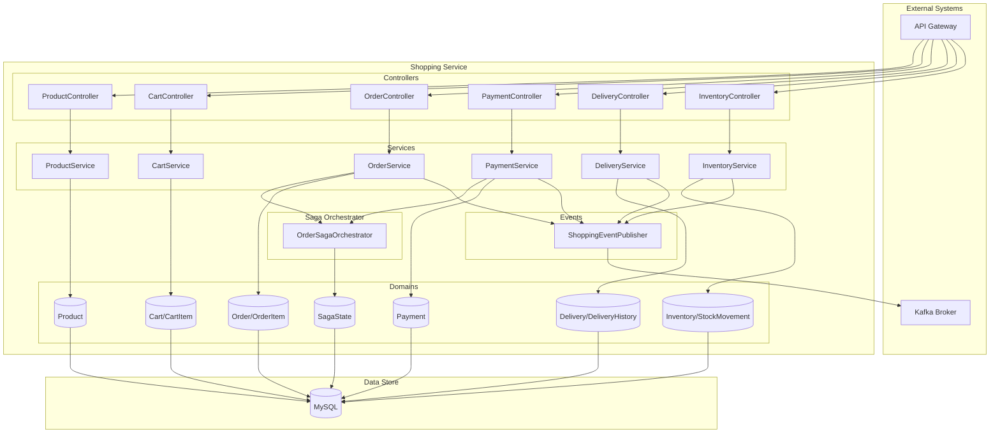
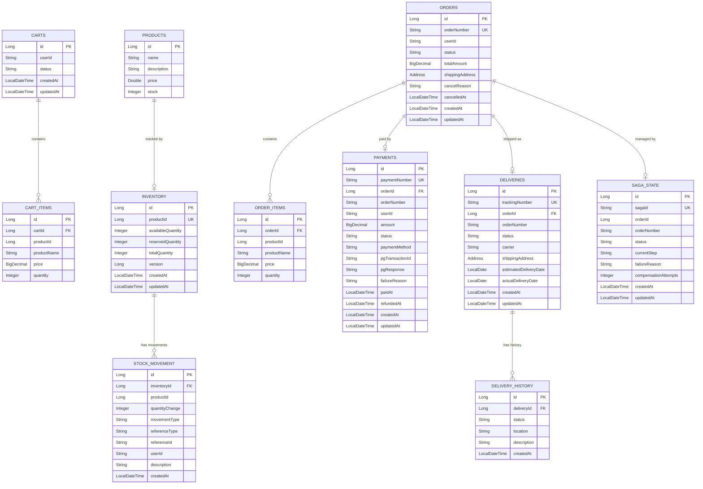

# Shopping Service System Overview

## 📋 개요

Shopping Service는 전자상거래 기능을 제공하는 마이크로서비스입니다. 상품 관리, 장바구니, 주문/결제, 재고 관리, 배송 추적 기능을 통합적으로 제공하며, Saga 패턴을 통한 분산 트랜잭션 처리를 구현합니다.

---

## 🎯 핵심 특징

- **도메인 주도 설계(DDD)**: 명확한 도메인 경계와 책임 분리
- **Saga 패턴**: 주문-재고-결제의 분산 트랜잭션 관리 및 보상 처리
- **이벤트 기반**: Kafka를 통한 비동기 이벤트 발행 및 서비스 간 통합
- **동시성 제어**: Pessimistic Lock을 활용한 재고 관리
- **확장 가능성**: 도메인별 독립적인 확장 가능

---

## 🏗️ High-Level Architecture



---

## 📦 도메인 구조

### 1. Product (상품)

| 항목 | 내용 |
|------|------|
| **역할** | 상품 정보 관리 (CRUD) |
| **엔티티** | `Product` |
| **주요 필드** | id, name, description, price, stock |
| **API** | GET/POST/PUT/DELETE `/api/v1/shopping/products` |

### 2. Cart (장바구니)

| 항목 | 내용 |
|------|------|
| **역할** | 사용자별 장바구니 관리 |
| **엔티티** | `Cart`, `CartItem` |
| **상태** | ACTIVE, CHECKED_OUT |
| **관계** | Cart 1:N CartItem |
| **API** | GET/POST/PUT/DELETE `/api/v1/shopping/cart` |

**CartItem 구조**:
- productId: 상품 ID
- productName: 상품명 (스냅샷)
- price: 단가 (추가 시점 가격)
- quantity: 수량
- subtotal: 소계 (price × quantity)

### 3. Order (주문)

| 항목 | 내용 |
|------|------|
| **역할** | 주문 생성 및 상태 관리 |
| **엔티티** | `Order`, `OrderItem` |
| **주문 번호** | `ORD-YYYYMMDD-XXXXXXXX` |
| **상태** | PENDING → CONFIRMED → PAID → SHIPPING → DELIVERED |
| **API** | GET/POST/PUT `/api/v1/shopping/orders` |

**주문 상태 전이**:
```
PENDING → CONFIRMED → PAID → SHIPPING → DELIVERED
   ↓          ↓
CANCELLED  REFUNDED
```

### 4. Payment (결제)

| 항목 | 내용 |
|------|------|
| **역할** | 결제 처리 및 PG 연동 (Mock) |
| **엔티티** | `Payment` |
| **결제 번호** | `PAY-XXXXXXXX` |
| **상태** | PENDING → PROCESSING → COMPLETED/FAILED |
| **결제 수단** | CREDIT_CARD, BANK_TRANSFER, VIRTUAL_ACCOUNT, KAKAO_PAY, NAVER_PAY |
| **API** | POST/GET `/api/v1/shopping/payments` |

**Mock PG Client**:
- 테스트 환경: 90% 성공, 10% 실패
- 실제 환경: 외부 PG 연동 필요

### 5. Delivery (배송)

| 항목 | 내용 |
|------|------|
| **역할** | 배송 추적 및 상태 관리 |
| **엔티티** | `Delivery`, `DeliveryHistory` |
| **운송장 번호** | `TRK-XXXXXXXXXXXX` |
| **상태** | PREPARING → SHIPPED → IN_TRANSIT → DELIVERED |
| **택배사** | 기본택배 (설정 가능) |
| **API** | GET/PUT `/api/v1/shopping/deliveries` |

**배송 이력 추적**:
- 각 상태 변경마다 `DeliveryHistory` 레코드 생성
- location, description 정보 포함
- createdAt 시간 기록

### 6. Inventory (재고)

| 항목 | 내용 |
|------|------|
| **역할** | 재고 관리 및 동시성 제어 |
| **엔티티** | `Inventory`, `StockMovement` |
| **재고 유형** | availableQuantity (가용), reservedQuantity (예약), totalQuantity (전체) |
| **동시성 제어** | Pessimistic Write Lock |
| **API** | GET/POST/PUT `/api/v1/shopping/inventory` |

**재고 이동 타입**:
| 타입 | 설명 | 재고 변동 |
|------|------|----------|
| PURCHASE | 입고 | available ↑, total ↑ |
| SALE | 판매 | available ↓ |
| RESERVATION | 주문 예약 | available → reserved |
| RELEASE | 예약 해제 | reserved → available |
| ADJUSTMENT | 수동 조정 | 직접 설정 |

---

## 💾 데이터베이스 스키마

### ERD



### 인덱스 전략

| 테이블 | 인덱스 | 컬럼 | 목적 |
|--------|--------|------|------|
| orders | idx_order_number | order_number (UK) | 주문번호 조회 |
| orders | idx_order_user_id | user_id | 사용자별 주문 조회 |
| orders | idx_order_status | status | 상태별 주문 조회 |
| orders | idx_order_created_at | created_at | 날짜별 조회 |
| payments | idx_payment_number | payment_number (UK) | 결제번호 조회 |
| payments | idx_payment_order_id | order_id | 주문별 결제 조회 |
| deliveries | idx_delivery_tracking_number | tracking_number (UK) | 운송장 조회 |
| inventory | idx_inventory_product_id | product_id (UK) | 상품별 재고 조회 |
| saga_state | idx_saga_order_number | order_number | 주문별 Saga 조회 |

---

## 🔗 외부 연동

### Kafka 이벤트 발행

| 이벤트 | Topic | 발행 시점 |
|--------|-------|----------|
| OrderCreatedEvent | order-created | 주문 생성 |
| OrderConfirmedEvent | order-confirmed | 주문 확정 |
| OrderCancelledEvent | order-cancelled | 주문 취소 |
| PaymentCompletedEvent | payment-completed | 결제 완료 |
| PaymentFailedEvent | payment-failed | 결제 실패 |
| InventoryReservedEvent | inventory-reserved | 재고 예약 |
| DeliveryShippedEvent | delivery-shipped | 배송 발송 |

### Feign Client (예정)

| 대상 서비스 | 용도 | 메서드 |
|------------|------|--------|
| auth-service | 사용자 정보 조회 | GET /api/v1/auth/users/{userId} |
| blog-service | 상품 리뷰 조회 | GET /api/v1/blog/reviews/product/{productId} |

---

## 🎯 기술 스택

### Backend

| 항목 | 기술 |
|------|------|
| Language | Java 17 |
| Framework | Spring Boot 3.5.5 |
| Security | Spring Security + JWT |
| ORM | Spring Data JPA (Hibernate) |
| Database | MySQL 8.0 |
| Messaging | Spring Kafka |
| API Client | Spring Cloud OpenFeign |
| Validation | Jakarta Bean Validation |
| Logging | SLF4J + Logback |

### Infrastructure

| 항목 | 기술 |
|------|------|
| Container | Docker |
| Orchestration | Kubernetes |
| Message Broker | Kafka 4.1.0 (KRaft) |
| Monitoring | Prometheus, Grafana |
| Tracing | Zipkin |

---

## 📊 성능 목표

| 지표 | 목표 | 현재 | 비고 |
|------|------|------|------|
| 응답 시간 (p95) | < 200ms | - | 주문 생성 제외 |
| 주문 처리 시간 | < 2초 | - | Saga 완료까지 |
| 동시 주문 처리 | 100 TPS | - | 재고 Lock 고려 |
| 재고 조회 | < 50ms | - | 캐시 적용 예정 |
| 가용성 | 99.9% | - | 연간 8.76시간 다운타임 |

---

## 🔒 보안

### 인증 및 인가

- API Gateway에서 JWT 검증 수행
- userId는 JWT 토큰에서 추출 (SecurityContext)
- 사용자별 리소스 접근 제어 (Cart, Order, Payment)

### 데이터 보호

- 민감 정보는 환경 변수로 관리
- PG 응답은 암호화 저장 고려
- 개인정보는 마스킹 처리 (로그)

---

## 🚀 확장 계획

### 단기 (1-3개월)

- [ ] Redis 캐싱: 상품 정보, 재고 조회
- [ ] 실제 PG 연동: 토스페이먼츠, 카카오페이
- [ ] 주문 알림: 이메일, SMS, Push 발송
- [ ] 상품 검색: Elasticsearch 통합

### 중기 (3-6개월)

- [ ] 쿠폰/프로모션: Discount 도메인 추가
- [ ] 배송 추적 API: 실제 택배사 연동
- [ ] 반품/교환: Return 도메인 추가
- [ ] 대량 주문 처리: Batch Job

### 장기 (6-12개월)

- [ ] 서비스 분리: Order, Payment, Inventory 각각 독립 서비스화
- [ ] Event Sourcing: 주문 이벤트 완전 추적
- [ ] CQRS 패턴: Command/Query 분리
- [ ] GraphQL API: 프론트엔드 유연성 향상

---

## 🔗 관련 문서

- [Data Flow](./data-flow.md)
- [Product API](../api/api-product.md)
- [Order API](../api/api-order.md)
- [Payment API](../api/api-payment.md)
- [Inventory API](../api/api-inventory.md)
- [Saga Pattern ADR](../adr/ADR-001-saga-pattern.md) (예정)

---

**최종 업데이트**: 2026-01-18
